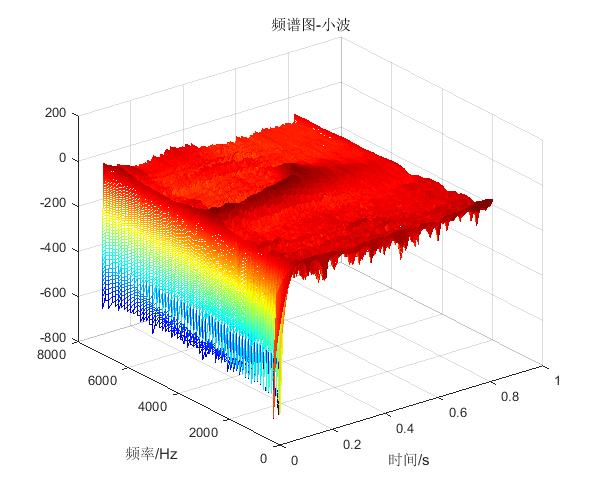

#asr

提取鸟声的特征信号所进行的端点检测与去噪处理

Author ：Jay K.  
E-mail   : Jwjier@gmail.com

通过`audioread`函数或者`matlab导入向导`将语音信号导入至工作区中。  [信号文件](/测试.wav)  

读取的语音信号信噪比非常低，鸟叫声基本被噪声湮没首先编写语谱图程序`WTspectrogramByzxf`，通过`频谱`观察语音信号。下图：

选择其中的语音由0~0.8S之间的语音,可以看出语音的波形上比较难分辨鸟叫声与噪声的。如果单纯的对信号进行傅里叶变换是没有办法提取时间信息的。通过观察小波频谱我们可以看到在0.1S～0.5S左右频谱出现的变化，也就是说在0.1S的时候语音信号产生了变化。通过对比音频信号，我们可以听到在0.1S～0.5S附近确实存在鸟叫声。那么我们可以通过对小波数据来进行端点检测，来截取比较精准的鸟叫声片段。

#### 通过matlab小波工具箱来进行可视化滤波

1、在`matlab的命令行`中`waveletAnalyzer`打开小波工具箱选择小波工具箱的`Wavelet 1-D`
2、点击 File > Import from Workspace > Import Signal.
3、打开workspace中的信号数据
	3.1、Wavelet选择小波类型
	3.2、Level选择小波层数
	3.3、点击analyze
	3.4、点击De- noise
	3.5、Select thresholding method选择阈值的方法
	3.6、soft的hard选项分别是软阈值与硬阈值
 因为不同语音段的噪声方差会随时间产生变化因此我们可以选择对不同的语音段设置不同的阈值，点击Interval Dependent Threshold Settings按钮可以对语音进行分段设置阈值。可以点击Generate Default Intervals的按钮自动设置也可以自己设置需要的分区。点击Propagate按钮将本级分层同步在所有的小波层上。点击close点击Y保存设置。 
点击De-noise进行去噪，通过选择File> Generate Matlab Code（Denoising Process）生产代码
